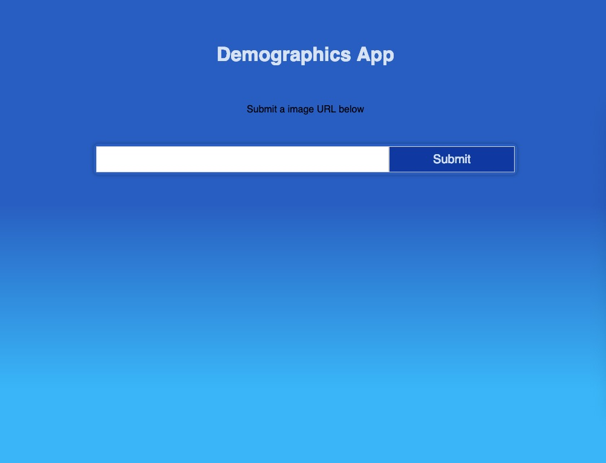
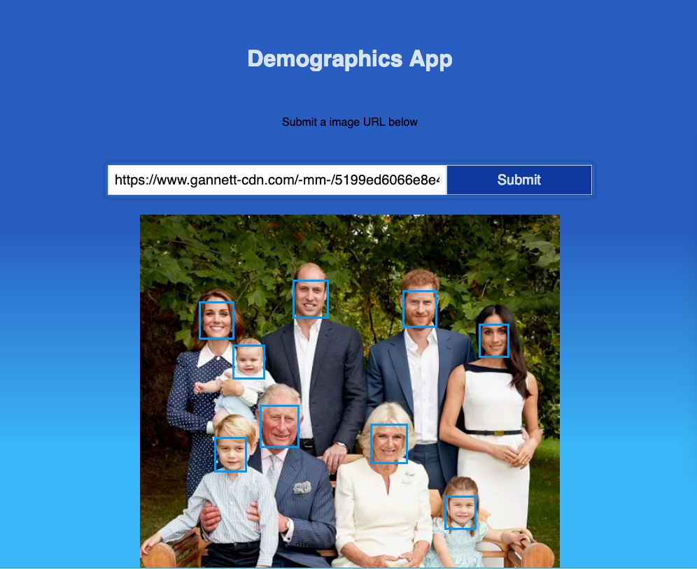
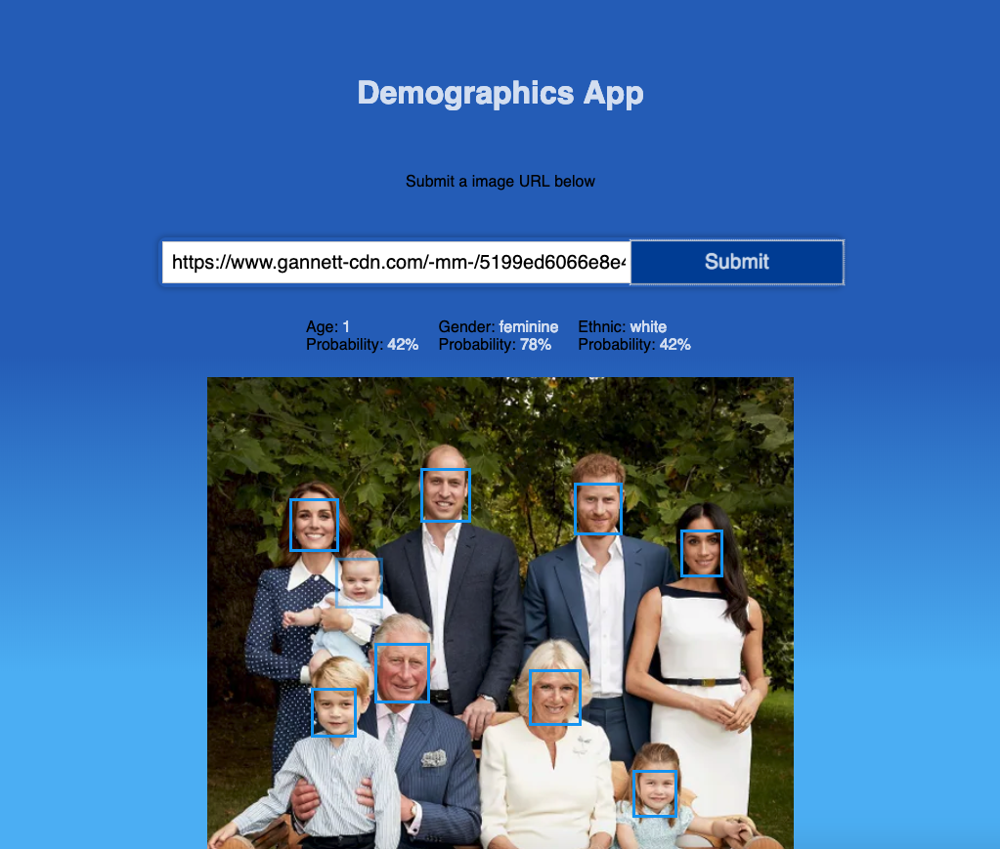

## Demographic App
### This app is using Clarifai API's DEMOGRAPHICS_MODEL
  - to predict people's age, ethnic, and gender 
  
### Screenshots with user stories

- In this page you can submit an image url link
 
 

- After submit button is clicked, the face(s) will be detected and responsed with a box around each face

 
 

- Hover over the boundry box to receive the corresponding information
 
 

  
This project was bootstrapped with [Create React App](https://github.com/facebook/create-react-app).

## Available Scripts
In project directory run:
- npm install
- npm start

