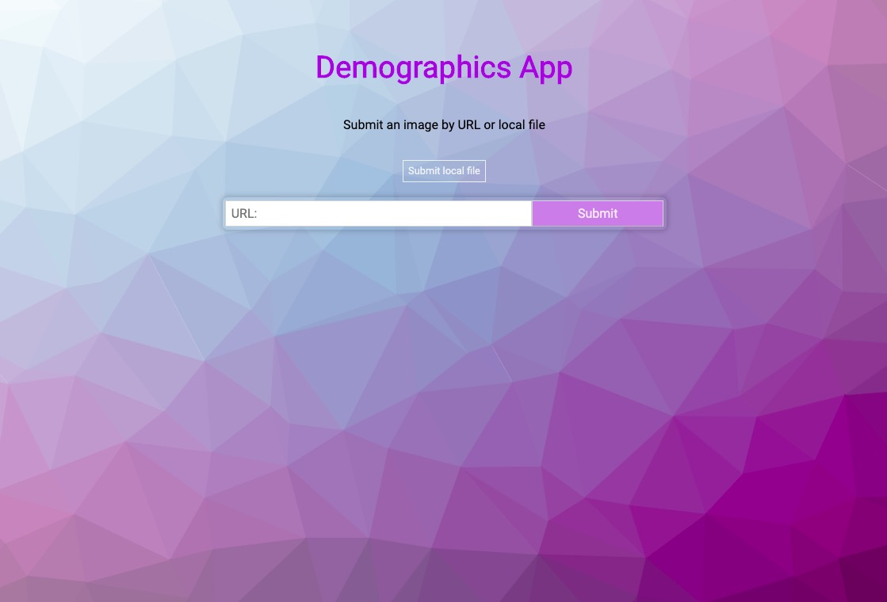
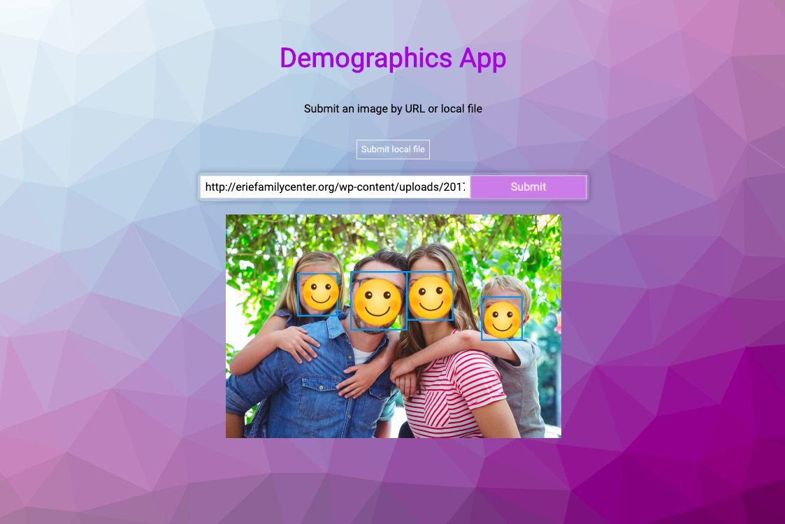
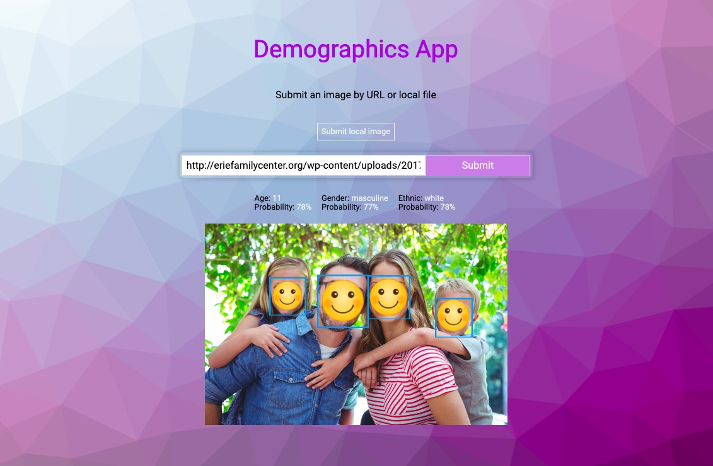

## Demographic App
### This app is using Clarifai API's DEMOGRAPHICS_MODEL
  - Detect face(s) on an image
  - Predict people's age, ethnic, and gender 
  
### Screenshots with user stories
###  
- In this page you can submit an image url or local file
 

### 
- After submit button is clicked, the face(s) in the image will be detected 

### 
- Hover over the boundry box to get the corresponding information(age,gender,and ethnic)
- Only the one with highest posibility will be displayed for each category
 

  
This project was bootstrapped with [Create React App](https://github.com/facebook/create-react-app).

## Available Scripts
In project directory run:
- npm install
- npm start

